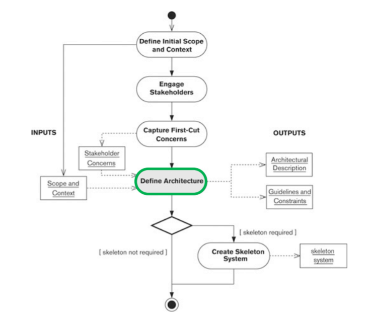

# Clase 4

## ADD

> Un ADD *(Architecture Description Document)* es un documento utilizado para represnetar y formalizar el diseño de un arquitectura. esta compuesto de elementos arquiteconicos. Es una herramienta que puede ayudar a los stakeholders a entender el sistema.

## Elemento Arquitectonico

> Un  elemento arquitectonico es una pieza fundamental con la que un sistema puede ser construido. Cada elemento debe posee los siguientes elementos:

- Conjunto de responsabilidades bien definidas.
- Frontera.
- Interfaces.

## Proceso de definicion de una arquitectura

