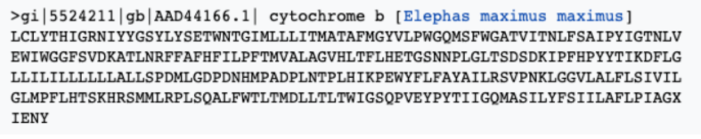
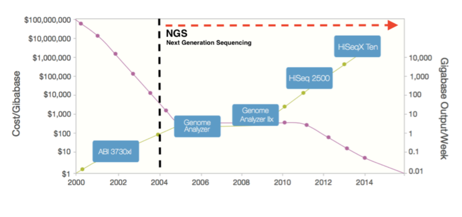
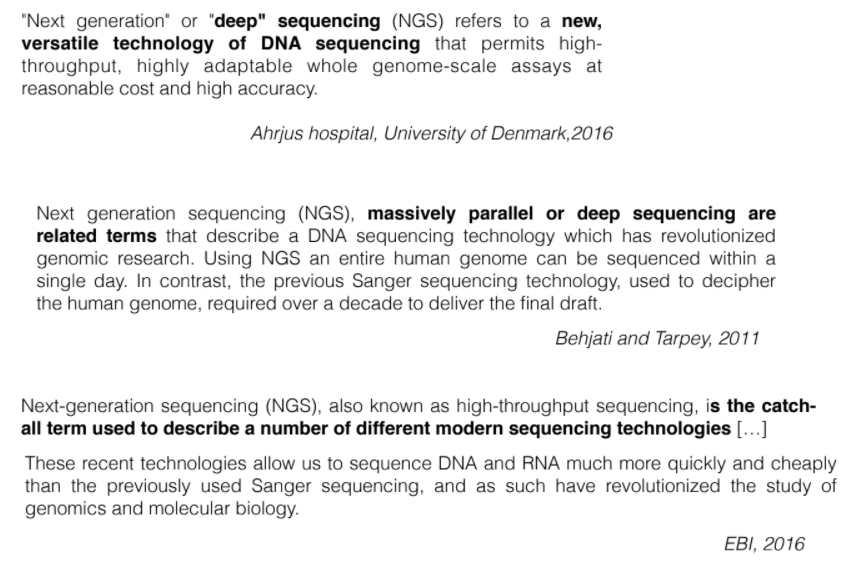
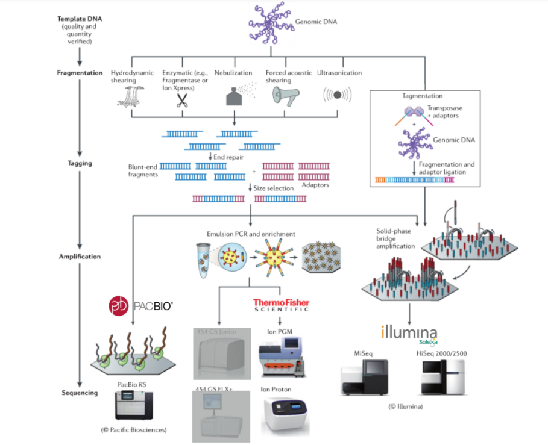

# CLASE 2 Introduccion a la secuenciacion de ADN

> La secuenciacion de ADN es un metodologia que permite traducir el ADN y convertirlo en un archivo de texto.

- Extraccion
- Secuenciacion
- Comprobacion (**BASE CALLING**)

## Formatos

### - FASTA

> Es el formato estandar para la distribucion de secuencias biologicas

> podemos notar que la primera linea es la cabecera de el archivo, la siguiente linea lleva la secuencia de informacion, (nucleotidos, aminoacidos, etc).

> Si se desea se pueden encadenar varias secuencias cada una separada por su propia cabecera en un solo archivo. A esto se le llama multi-FASTA.

### - Secuenciacion SANGER

> La secuenciacion Sanger era la secuenciacion mas utilizada previo a la NGS, esta es considerada el "Gold Standard" debido a que causo una revolucion en la forma que se secuenciaba. Tambien es ampliamente utilizada en la secuenciacion moderna, ya que genera secuencias de muy alta calidad.

**ESTUDIAR SECUENCIACION SANGER**

- ["Video de secuenciacion"](http://www.youtube.com/watch?v=NEu0mO-2ras)

- El **Base Calling** es el paso en el que se revisa cada base con su longitud de onda

- El **Electroferograma** es el grafico donde se muestra cada basse con su respectiva longitud de onda

*Cuando la secuencia es muy ruidosa el secuenciador asigna una **N** a esa secuencia*

### - NGS next generation sequency

> La secuenciacion de siguente generacion permitio optimizar todos los procesos de secuenciacion, lo que permitio disminuir costos y en consecuencia las bases de datos de las secuencias aumentan su tamaño.

### Perparacion para la secuenciacion

> El proceso previo a la secuenciacion, es llamado creacion de librerias.

*Se pude esperar que un tejido, la cantidad de genes que estan activo, es aproximadamente del 20% del total*

> Normalmente para la muestra de ADN se consigue por medio de la extraccion en un tejido del organismo.

[bionumbers](https://bionumbers.hms.harvard.edu/search.aspx)

- Si tengo *n* celulas, puedo obtener *n* muestras de ADN.

> Posteriormente, se busca dividir el ADN en varias partes. Estas partes son dividas de forma aleatoria, ya que no se puede controlar.

> En el siguiente proceso se busca reparar los bordes.

> Luego a cada uno de los fragmentos ya reparados, se les adiciona en el inicio y final unos adaptadores, que son secuencias ya conocidas. Este proceso se llama TAGGING. Se pueden colocar varios TAGS a una sola muestra, estos TAGS cumplen tareas muy especificas y utiles (ver despues). 

> Finalmente viene un proceso de seleccion por tamaño (size selection), ya que las diferentes tecnicas de secuenciacion admiten tamaños de secuencias especificos. Se espera que los fragmentos seleccionados sean muestras representativas.

>Al grupo de los fragmentos seleccionados se les realiza un proceso de amplificacion (Copiar).

*No todas las tecnicas realizan el proceso de amplificacion*

- Proceso de creacion de librerias

