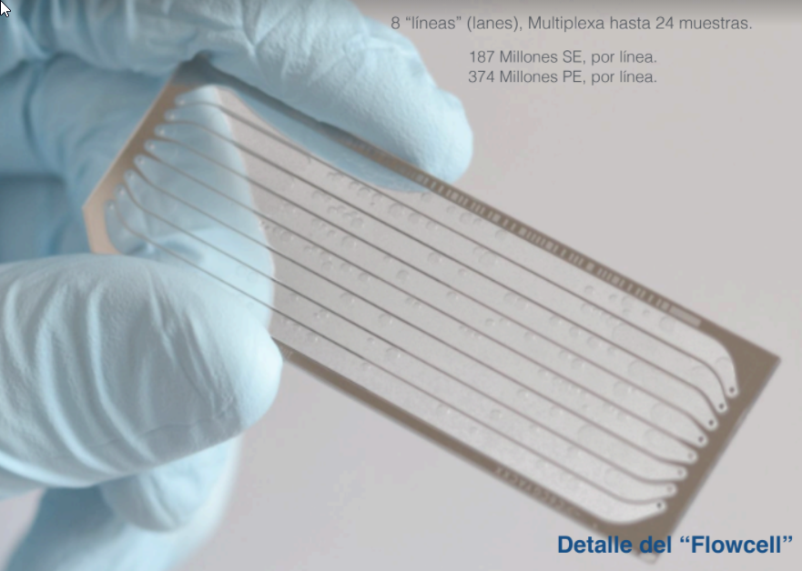
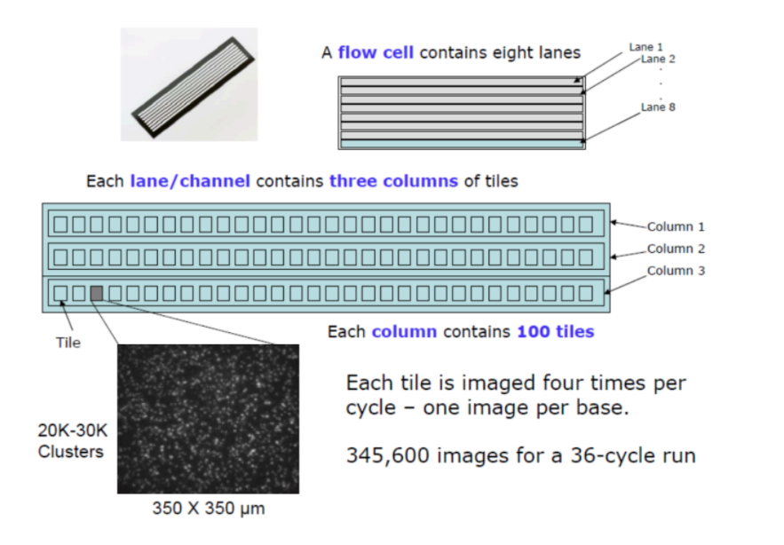
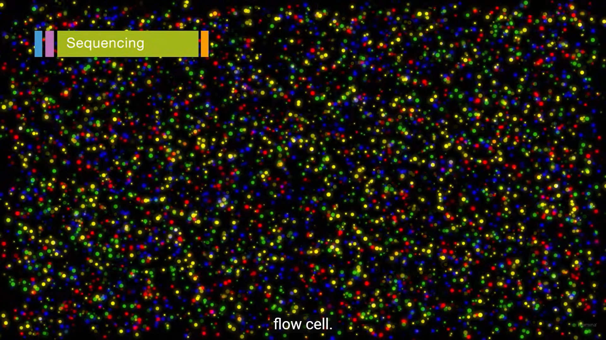
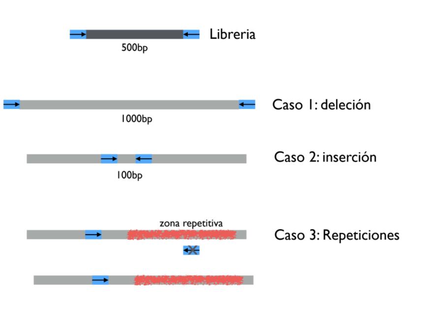

# Clase 3

Se va a ver los metodos de secuenciacion moderna por medio de *Illumina*.

## Illumina

- ["Illumina video"](https://www.youtube.com/watch?v=fCd6B5HRaZ8)

### FlowCell

> Un flowcell posee varios "carriles" que en ingles se denomina *lanes*, en español les decimos *lineas*. Entender la arquitectura de estos flowcells es base para entender la profundidad de secuenciacion.

> Las lineas nos dan una idea del output de secuenciacion.

### Output de secuenciacion

> Es la medida que determina cuanta informacion puede secuenciar en un ciclo una maquina determinada.

- Si una maquina tiene 8Gbp de output y tengo un flowcell con 8 lineas, queire decir que en cada linea puedo secuenciar 1Gbp.

- Si el genoma de la e-coli es de 5Mbp, en una linea de 1 Gbp puedo secuenciar 200 veces el genoma de la bacteria en una linea. A esto le puedo decir que tienen una *profundidad de secuenciacion* de 200x

### Arquitectura interna de un flowcell

- Un flowcell esta dividido en varias lineas.
- Cada linea esta dividida en 3 columnas.
- Cada columna esta dividida en *tiles* o baldosas.
- Cada tile, puede almacenar ~25k **clusters**.

### Cluster generation

> El cluster generation es el proceso cuando se amplifica el DNA, a un conjunto de hebras de DNA se llama **cluster**. En un cluster solo hay una hebra DNA original y *n* amplificadas.

### Generacion de clusters; *Bridge Amplification*

> Cada tile tiene *oligos* pegadas al lane, son secuencias de ADN complementarias a los *TAGS* que se incluyeron previamente.

- Una vez el ADN se pega a los oligos, con ayuda de una polimeraza empieza a generar la secuencia complementaria "*reverse*".

- Una vez generada la secuencia complementaria por medio de bridge amplification, se genera otra cadena complementaria que es un clon perfecto a la secuencia original. Esto lleva a que en todo el flowcell hay secuencias forward y reverse.

- Posteriormente se lavan todas las secuencias reverse. quedando unicamente solo copias identicas a las secuencias originales.

> El proceso sucede de manera paralela en todo el flowcell al mismo tiempo.

### Sintesis y secuenciacion

> Igual que en sanger, tenemos nucleotidos con "cluoroforos fluorocloros", la diferencia es que al incorporarse, no detienen la sintesis.

1. Una vez el nucleotido se incorpora emite una longitud de onda.

> Esto esta pasando al mismo tiempo en todo el cluster, es decir al llegar una timina por ejemplo, se esta emitiendo la luz de muchas timinas al mismo tiempo. Esto amplifica la señal y mejora la calidad de lectura.

2. La intensidad de la señal determina el *base call* para determinar el nucleotido respectivo.
3. Se limpia

> Este proceso es un ciclo que se repite para cada nucleotido de la cadena. La cantidad de ciclos es determinada por la maquina, esto limita la longitud de la lectura.

> Este proceso se llama secuenciacion de sintesis.

> En *Single end* si tengo una muestra que su tamaño es mayor al numero de ciclos, espero que el ADN que no puedo secuenciar, en un cluster, quede secuenciado en otro.

### Paried end

> Posteriormente *Illumina* mejoro su proceso, para solucionar el problema dce *Single end*. Esto lo hacen al finalizar la primera lectura.

- Haciendo bridge amplification. Esto genera clusters con la secuencia reverse.

- Se hace la lectura por sintesis nuevamente.

> Al finalizar se habran leido el inicio y el final de la hebra. Muchas veces habra un hueco no secuenciado en la mitad de la hebra. Este proceso se llama *Paired end*.

> Estos datos de secuenciacion llegan en archivos separados, con extension *.fq*.

> El tamaño del "hueco" que queda entre la secuenciacion forward y backward es importante para ensamblar secuencias.

**Consulta de multiplexing**