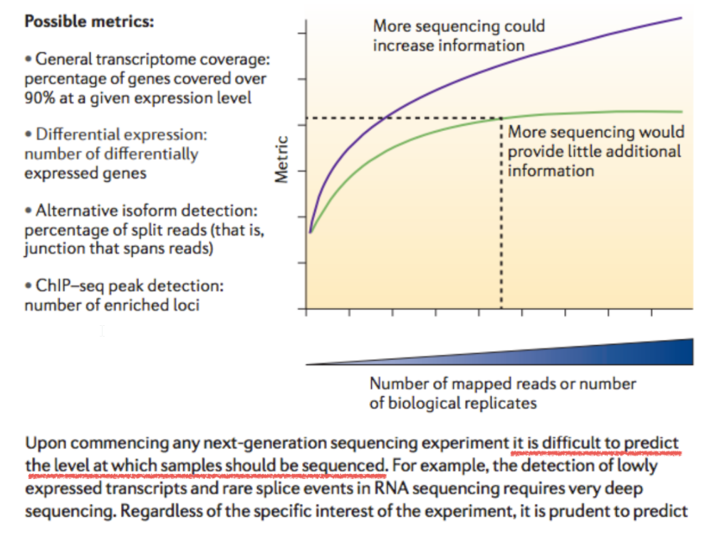
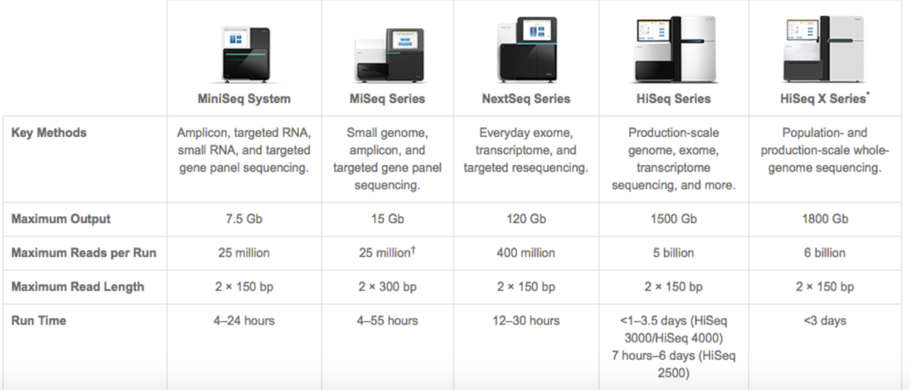
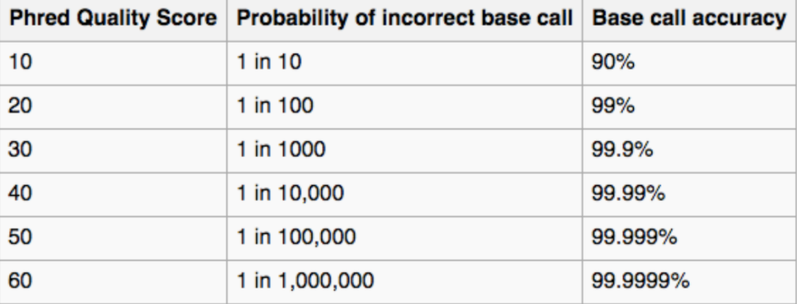

# Clase 4

## Barcoding

> Es un secuencia de ADN especifica que me permite diferenciar a un grupo taxonomico de otros.

## Multiplexing

> Es una tecnologia que permite secuenciar varias muestras en el mismo flowcell. Esto se logra agregando barcodes en la fase de creacion de librerias.

> El multiplexing ayuda a que el usuario pueda secuenciar muestras pequeñas de forma economica.

## Profundidad de secuenciacion

> Si secuencio a *10x* quiere decir que en promedio, tendre 10 veces cada base.

### Que profundidad es necesaria?

> Depende de la tecnica de secuenciacion. Por ejemplo en Sanger, una profundidad de *7~10x* es bastante buena.

> Normalmente el punto en el que la profundidad de secuenciacion en un **genoma**, que no proporciona mas informacion es en promedio *~50X*.

### Profundidad en RNA

> Cuando se va a secuenciar RNA no se habla en *X* sino en **millones de lecturas**, entre mas millones de lecutras, mas probabilidad de ver genes poco expresados.

* En un clavel ~17 millones por libreria.
* En el genoma humano ~30 millones por libreria.

#### En conclusion, se puede decir que la profundidad de secuenciacion depende de la tecnologia, el tipo de dato y factores del contexto de la muestra.

## Q-Score

> 30 es el valor que se espera por posicion en el electroferograma. El minimo aceptable es 20.
